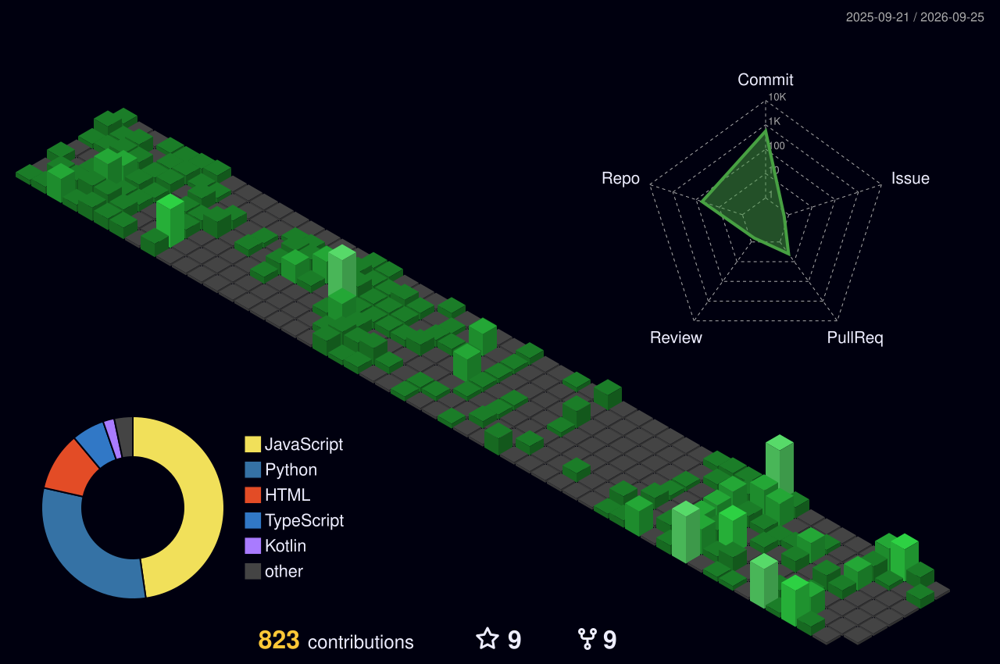

<div align="center">


<br>


<br><br>


</div>

---

# 🚀 About Me

- 🎓 B.Tech Artificial Intelligence & Data Science @ Bannari Amman Institute of Technology
- 🏆 National-Level Hackathon Winner (MOBILITYX 2.0, SheHacks'25, FIESTAA'25)
- 🤖 Building AI products using LLMs, Agentic AI, and Computer Vision
- 🌾 Creator of AI solutions for Agriculture, Education, Healthcare, and Smart Mobility
- 🚀 Exploring AI Startups, SaaS Platforms, and Multi-Agent Systems
- 🎯 Focused on transforming innovative ideas into real-world products

---

## 🌐 Connect With Me

<div align="center">

<a href="https://linkedin.com/in/gokul-v-92bbb5329/" target="_blank">
  
</a>
<a href="mailto:gokul9942786@gmail.com">
  
</a>
<a href="https://huggingface.co/GokulV" target="_blank">
  
</a>
<a href="https://leetcode.com/u/Gokul_leetcode/" target="_blank">
  
</a>
<a href="https://www.hackerrank.com/profile/gokulvm_ad24" target="_blank">
  
</a>

<br>

<a href="https://github.com/Gokul-bit165">
  
</a>

</div>

---

# 🛠️ Tech Stack

### 🤖 Artificial Intelligence
- Machine Learning
- Deep Learning
- Generative AI
- Agentic AI
- NLP
- Computer Vision
- YOLO
- OpenCV
- Transformers
- Hugging Face

### ⚡ Backend Development
- Python
- FastAPI
- REST APIs
- MongoDB
- ChromaDB

### 🌐 Frontend Development
- React
- HTML
- CSS
- JavaScript

### 🐳 DevOps & Tools
- Docker
- Linux
- Git
- GitHub Actions

<div align="center">


</div>

---

# 📊 GitHub Stats

<div align="center">


<br>


<br>


<br>


</div>

---

# 🐍 Contribution Snake

<div align="center">


</div>

> Generated automatically by the workflow in `.github/workflows/snake.yml` (included in this repo).

---

# 🌐 3D Contribution Graph

<div align="center">



</div>

> Powered by the [`profile-3d-contrib`](https://github.com/yoshi389111/github-profile-3d-contrib) action — add it as a workflow in this repo to auto-generate the SVG above.

---

# 🚀 Featured Projects

<details>
<summary>⚽ Football Analytics Platform</summary>

```bash
STACK:
YOLO11 • OpenCV • DeepSORT • MLflow

FEATURES:
✓ Player tracking
✓ Ball tracking
✓ Team classification
✓ Possession & trajectory analysis
```

</details>

<details>
<summary>🧠 LearnQuest</summary>

```bash
AI-powered learning and proctoring platform

FEATURES:
✓ AI Tutor
✓ Computer Vision Monitoring
✓ Smart Assessments
✓ Student Analytics
```

</details>

<details>
<summary>🌾 AgriPilot</summary>

```bash
AI-driven agriculture intelligence platform

FEATURES:
✓ Crop Insights
✓ Land Mapping
✓ AI Recommendations
✓ Future IoT Integration
```

</details>

<details>
<summary>❤️ Mental Health AI Platform</summary>

```bash
FEATURES:
✓ Early Emotional Detection
✓ AI Assistance
✓ Wellness Support
```

</details>

<details>
<summary>🚦 Smart Traffic AI</summary>

```bash
Computer Vision-based traffic monitoring system
```

</details>

<details>
<summary>🍽️ AI Last Meal</summary>

```bash
AI solution for reducing food waste through
intelligent food recognition and redistribution
```

</details>

---

# 🏆 Achievements

🥇 MOBILITYX 2.0 — National Level Hackathon Winner (₹20,000)
🥇 SheHacks'25 — 1st Place
🥇 FIESTAA'25 — First Prize
🏅 HackXelerate 2025 — Finalist
🎓 Vice Chairman — IEEE Student Branch, BIT

---

# 🎯 Currently Building

🔹 AI Contact Intelligence Platform
🔹 Multi-Agent AI Systems
🔹 AI SaaS Products
🔹 AgriPilot
🔹 RAG + MCP Architectures
🔹 Open Source Contributions
